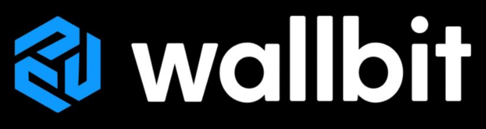
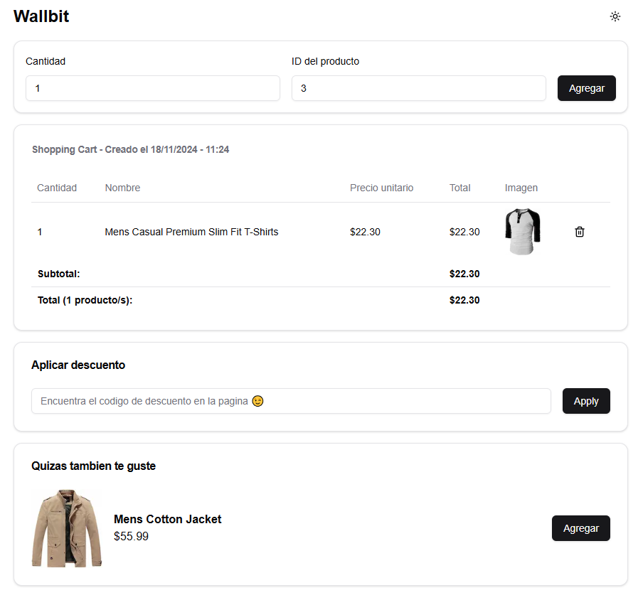
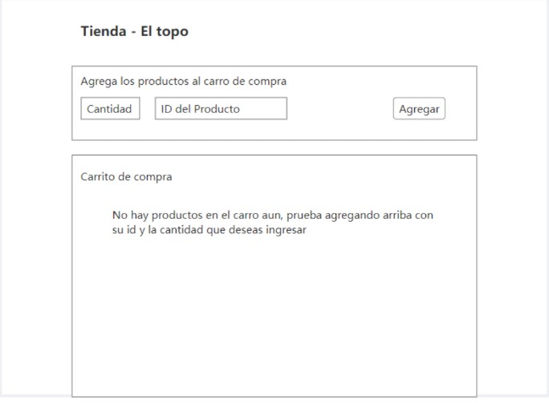
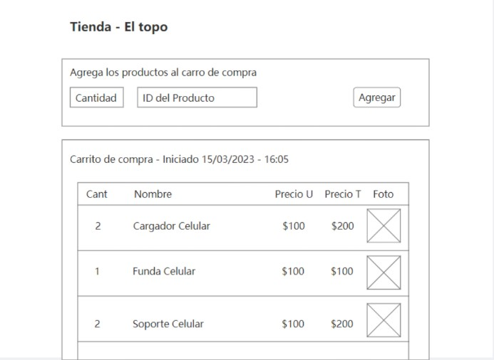

[](https://wallbit.io/)

> El banco digital para trabajadores remotos.



# Configuracion del proyecto

para instalar las dependencias correr el comando:

```
npm i
```

Para levantar el proyecto

```
npm run dev
```

# Wallbit Junior Frontend Challenge

Para este desafío, nuestro cliente nos encargó hacer un carrito de compras para programadores. Tiene un formulario con 2 campos: ID del producto y cantidad. Los programadores habitualmente no necesitan saber ni ver que productos comprar, sino que saben por conexiones astrales cual es el ID del producto que quieren y así los agregan a su carrito.

Cada vez que se agrega un producto, vamos a obtener el producto desde la API y lo vamos a mostrar en una tabla, junto a la cantidad que el usuario eligió.

> Solo lo mostramos visualmente por si hay alguien que no sea programador mirando la pantalla.

La aplicación se vería así:



> Inicialmente no hay productos en el carrito



> Con productos en el carrito

## Requisitos

La API que nos dió nuestro cliente es: [Fake Store API](https://fakestoreapi.com/). El cliente nos dijo que su stack de frontend es React, que prefiere el challenge hecho con eso, pero está abierto a cualquier stack que quieras usar.

- [x] Podemos agregar productos al carrito.
- [x] Manejar errores que nos devuelva la API.
- [x] Mostrar una lista con los productos agregados incluyendo `title`, `price` e `image` del producto y la `cantidad` que el usuario agregó.

## Extras

- [x] El carrito se persiste al recargar la página.
- [x] Mostrar el total de productos agregados.
- [x] Mostrar el costo total del carrito.
- [x] Mostrar la fecha de creación del carrito.

## Bonus

Para destacar, podés agregar cualquier cosa que se te ocurra que llame la atención. No tiene por qué ser necesariamente en el código, o una dependencia. Puede ser algo visual, un easter egg, una funcionalidad, o bueno, algo en el código.

> [!NOTE]
> Siempre recordá que lo que agregues debe sumar a la experiencia del usuario y no complicar su navegación. Tenés que pensar que quien va a usar la aplicación no va a haber hablado con vos previamente y aun así debería poder usar la aplicación y obtener la mejor experiencia posible.

## Entregables

- [ ] Crear un Pull Request a este repositorio con tu solución.
- [ ] Reemplazar el `README.md` con instrucciones para correr el proyecto e información relevante para la evaluación.
- [ ] Incluir el link al deploy de tu aplicación.

## Premio

Se va a entregar un premio en vivo durante [mi stream](https://twitch.tv/goncypozzo) el 19 de Noviembre de 2024 a las 19:00hs Argentina (GMT -3) entre todos los que completen el desafío. El premio va a ser un micrófono Razer Seiren Mini.

El ganador va a ser elegido por el chat, la gente de Wallbit y yo.

> [!IMPORTANT]
> El ganador debe estar presente en el stream para recibir el premio.


> En caso de no poder enviarse el premio, se pagará el equivalente de 70 USD.

El deadline para enviar el PR es el 19 de Noviembre de 2024 a las 15:00hs Argentina (GMT -3).

> [!IMPORTANT]
> Los PRs se cerrarán luego de esa hora así que no te olvides de hacerlo antes.
